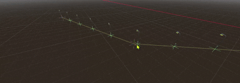

# 样条线摆放插件 / Spline Item Placer

一个 Godot 4 工具脚本：沿控制点折线均匀摆放物品（例如沿马路摆放路灯），支持在编辑器中直接拖动控制点，实时预览，并记录每个点的世界坐标。

## 功能特性

- 控制点以 `Marker3D` 子节点形式存在，可在场景中直接用编辑器移动/旋转工具拖动
- 相邻控制点之间直线相连，物品按线条总长度均匀分布
- 点的数量可调（`point_count`），可选是否包含两端端点（`include_endpoints`）
- 自动记录每个点在世界坐标系中的坐标（`point_world_positions`）
- 公开变量 `item_scene` 设置要放置的物品
- 编辑器内实时预览：黄色线 = 线条，红色十字 = 控制点，绿色十字 = 放置点
- 物品可自动朝向路径行进方向（`align_to_path`）
- `@tool` 脚本，运行时同样会生成物品

## 使用方法

1. 把 `spline_item_placer.gd` 复制到你的项目中
2. 在场景中添加一个 `SplineItemPlacer` 节点（自动生成两个控制点）
3. 在场景中选中菱形标记，直接拖动控制点调整线条
4. 在检查器中设置 `item_scene`（要放置的物品）与 `point_count`（点的数量）
5. 需要更多控制点时，点击检查器里的"添加控制点"按钮

## 属性说明

| 属性 | 说明 |
| --- | --- |
| `item_scene` | 要放置在每个点上的物品（PackedScene） |
| `align_to_path` | 物品是否自动朝向线条行进方向（绕 Y 轴旋转） |
| `point_count` | 均匀分布在整条线上的点的数量 |
| `include_endpoints` | 点数是否包含线条两个端点 |
| `show_debug_lines` | 是否显示辅助线（黄线/红叉/绿叉） |

## 公开数据与方法

- `point_world_positions: Array[Vector3]` — 每个点在世界坐标系中的坐标（自动记录，只读）
- `control_point_world_positions: Array[Vector3]` — 每个控制点在世界坐标系中的坐标
- `rebuild()` — 重新计算所有点的世界坐标并重新放置物品
- `get_point_world_positions() -> Array[Vector3]` — 获取每个点的世界坐标
- `get_control_points() -> Array[Vector3]` — 获取所有控制点的局部坐标

## 环境要求

- Godot 4.4+（使用 `@export_tool_button`，需要 4.3+）

## 许可

MIT License
